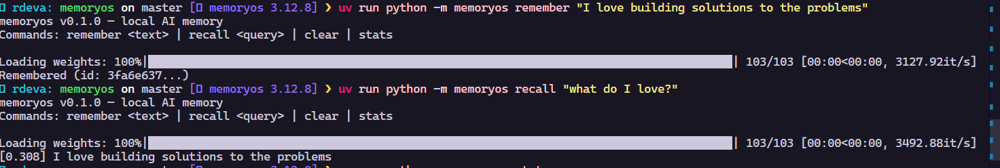
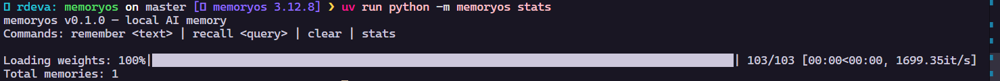

# memoryos

[](https://github.com/Devarajan8/memoryos/actions)

> Persistent, queryable memory for any Python AI app — local-first, zero API cost.

[](https://pypi.org/project/memoryos-official/)
[](https://opensource.org/licenses/MIT)
[](https://www.python.org/downloads/)

---

## What is it?

`memoryos` gives any AI app a long-term memory layer — without needing an API key, a cloud service, or a database server.

Store things. Recall them semantically. Forget them. All locally.

```python
from memoryos import Memory

mem = Memory(user_id="arjun")

mem.remember("I prefer dark mode and use VS Code")
mem.remember("Currently building a job application assistant")
mem.remember("I like concise answers over long explanations")

results = mem.recall("what tools does the user prefer?")
for r in results:
    print(f"[{r['score']:.3f}] {r['text']}")
```

```
[0.412] I prefer dark mode and use VS Code
[0.289] I like concise answers over long explanations
```

## CLI Demo



### Stats



---

## Install

```bash
pip install memoryos-official
```

---

## Features

- **Semantic recall** — finds memories by meaning, not exact keywords
- **Memory decay** — old memories fade in relevance automatically
- **Importance scoring** — weight memories by how significant they are
- **Tags** — organize memories into namespaces
- **Forget & clear** — GDPR-friendly deletion
- **Local-first** — uses FAISS + SQLite, no external services
- **Zero cost** — no API keys, no cloud, runs on your machine

---

## API Reference

### `Memory(user_id, db_path)`

```python
mem = Memory(user_id="alice", db_path="memory.db")
```

| Param     | Default       | Description                                           |
| --------- | ------------- | ----------------------------------------------------- |
| `user_id` | `"default"`   | Isolates memories per user                            |
| `db_path` | `"memory.db"` | SQLite file path. Use `":memory:"` for in-RAM (tests) |

---

### `remember(text, tags, importance, decay_days)`

Store a memory.

```python
mid = mem.remember(
    "User just got promoted to SDE-2",
    tags=["career", "milestone"],
    importance=0.9,   # 0.0–1.0, default 0.5
    decay_days=90,    # score halves every 90 days, 0 = no decay
)
```

Returns: `str` — the memory ID (use it to `forget()` later)

---

### `recall(query, top_k)`

Find the most semantically relevant memories.

```python
results = mem.recall("what is the user's job status?", top_k=3)
# [{"id": ..., "text": ..., "score": 0.87, "tags": [...], ...}]
```

---

### `forget(memory_id)`

Delete a specific memory.

```python
mem.forget(mid)
```

---

### `clear()`

Wipe all memories for this user.

```python
mem.clear()
```

---

### `export(filepath)`

Backup all memories to JSON.

```python
mem.export("my_memories.json")
```

---

## How it works

1. **`remember()`** → text is embedded using `sentence-transformers` (all-MiniLM-L6-v2, runs locally) → vector stored in FAISS, metadata in SQLite
2. **`recall()`** → query is embedded → FAISS finds top-k nearest vectors → SQLite returns the original text
3. **Scoring** → final score = cosine similarity × (0.7 + 0.3 × decayed importance)

---

## Why not mem0 / Zep / etc.?

|                | memoryos | mem0       | Zep        |
| -------------- | -------- | ---------- | ---------- |
| Local-first    | ✅       | ❌         | ❌         |
| API key needed | ❌       | ✅         | ✅         |
| Cost           | Free     | Paid tiers | Paid tiers |
| Memory decay   | ✅       | ❌         | ❌         |
| `pip install`  | ✅       | ✅         | ✅         |

---

## Stack

- [`sentence-transformers`](https://www.sbert.net/) — local text embeddings
- [`faiss-cpu`](https://github.com/facebookresearch/faiss) — vector similarity search
- `sqlite3` — metadata storage (built into Python)

---

## License

MIT © Devarajan
